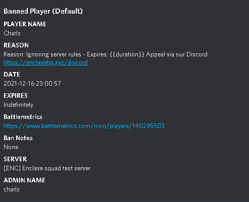

Each configuration is a different message configuration of that of the default one, to use a different configuration, Replace the DiscordBanNotifyer.py file with a variation of the new config files. You can then remove the config name from the embed in line 119.

Each configuration has its own layout and information provided.

In the Default configuration, that comes preset up with the bot you get:
Player Name
Reason
Ban Date
Expiry date
BM link
Ban notes
Server Banned on
Admin name

IN Configuration One- 
Player name, Admin name
Reason
Ban Date, Expiry date
Battlemetrics profile link
Server banned on

In Configuration Two
Player name, Admin name
Reason
Ban Date, Expiry date
Battlemetrics profile link
Ban Notes
Server banned on

In Configuration Three-
Player name, Admin name
Reason
Ban Date, Expiry date
Battlemetrics profile link

