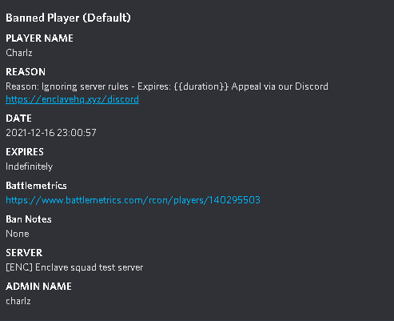
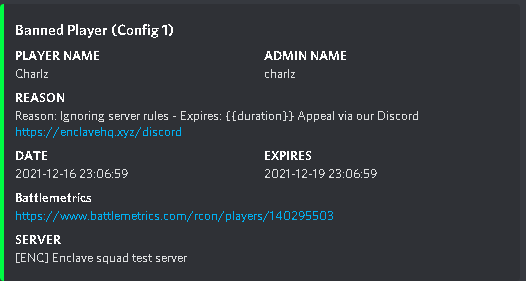
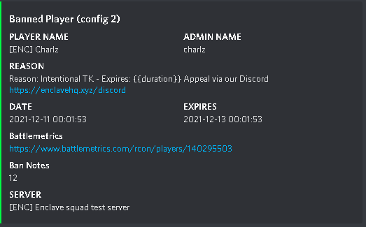
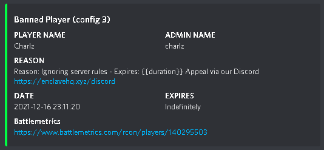

# DiscordBattlemetricsBanBot

A bot that uses the Battlemetrics API to poll information about recently banned players and updates a discord servers Bans text channel automatically whenever it detect new bans.

Setup
Script is written in Python 3.8

1.Run the following to setup the environment:

```$ pip install -r requirements.txt```

2.Edit lines, 7, 9,11,15,17 and 19(if you wish) in the config.ini

on line 7 include the full discord Username and number

on line 9 include your discord bot token

on line 11 include the discord channel id you wish for the bot to send the message into

on line 15 you need to create a BM access token through the BM developer area https://www.battlemetrics.com/developers, and input this here

on line 17 input your ban list ID, this can be found by going to ban lists-select your ban list and click update the string after /update/<string> is your BM ban list ID

If you wish to change the polling interval change this setting on line 19

    There are multiple message configurations these are all shown below-
    Each configuration is a different message configuration of that of the default one, to use a different configuration, Replace the DiscordBanNotifyer.py file with a variation of the new config files. You can then remove the config name from the embed in line 119.

    Each configuration has its own layout and information provided.

    In the Default configuration, that comes preset up with the bot you get:
    Player Name
    Reason
    Ban Date
    Expiry date
    BM link
    Ban notes
    Server Banned on
    Admin name

    

    IN Configuration One- 
    Player name, Admin name
    Reason
    Ban Date, Expiry date
    Battlemetrics profile link
    Server banned on
    

    In Configuration Two
    Player name, Admin name
    Reason
    Ban Date, Expiry date
    Battlemetrics profile link
    Ban Notes
    Server banned on
    

    In Configuration Three-
    Player name, Admin name
    Reason
    Ban Date, Expiry date
    Battlemetrics profile link

    

*known issue- Names with Non UTF-8 Charicters wont be posted due to them characters
